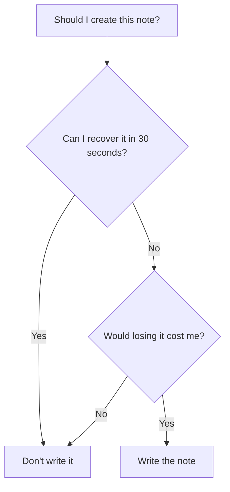

> *The most important question in note-taking isn't **How should I organize my notes?** It's **Why should this note exist at all?***

Every few months I come across another article or YouTube video promising that a **Second Brain** will change the way I learn.

Capture everything.

Link everything.

Build a personal Wikipedia.

Trust that your future self will thank you.

I have a problem with that advice—not because note-taking is useless, but because I think we've skipped a far more fundamental question.

> **Before writing any note, ask one question: _So what?_**

If you can't answer it convincingly, maybe the note shouldn't exist.

---

## The Question We Rarely Ask

Imagine you're learning recursion.

Should you write a note explaining recursion?

My answer is usually **no**.

There are already excellent books, lectures, official documentation, Stack Overflow discussions, and Wikipedia articles. Any explanation I write will almost certainly be worse than those.

So what am I actually adding?

Probably nothing.

The internet doesn't suffer from a shortage of information.

It suffers from a shortage of **understanding**.

---

## Information Isn't Scarce Anymore

Today's scarce resources are different.

- Judgment
- Experience
- Context
- Decisions
- Hard-earned lessons

Those are things Google cannot reconstruct for you.

That changes what a note should contain.

---

## Stop Competing With Documentation

Suppose your vault contains notes like:

- What is Docker?
- What is JSON?
- How recursion works
- Git branching explained

There is nothing *wrong* with those notes.

They're simply **replaceable**.

I now use a simple test.

> **If I deleted this note tomorrow, what knowledge would disappear?**

If the answer is:

> "Nothing. I can recover it from the official docs in thirty seconds."

Then I probably don't need the note.

---

## What *Is* Worth Writing?

Instead of copying facts, capture things that only **you** can produce.

For example:

> "I finally understood recursion when I stopped imagining a function calling itself and started imagining a problem becoming smaller until the answer became obvious."

Or:

> "I kept confusing Docker images and containers. The analogy that finally clicked was: image = class, container = object."

These aren't facts.

They're evidence of learning.

Even better are notes like:

- why your team chose one architecture over another,
- the production bug that took two days to find,
- the assumption that turned out to be wrong,
- the mental model that suddenly made a difficult topic obvious.

Those are expensive to rediscover.

---

## A Note Should Pay Rent

A note occupies more than disk space.

It occupies attention.

Every note becomes another object to:

- organize,
- search,
- review,
- maintain,
- or mentally filter.

Storage is cheap.

Attention isn't.

A note should justify its existence.

---

## "But Writing Helps Me Think"

This is, in my opinion, the strongest argument **for** taking notes.

Richard Feynman was famous for exposing gaps in his understanding by trying to explain things clearly.

The value wasn't necessarily the notebook.

The value was the thinking that happened while writing.

Sometimes the note is disposable.

The insight isn't.

> **The note is a by-product. Clear thinking is the product.**

---

## My Biggest Disagreement with Modern PKM

Many Personal Knowledge Management systems quietly encourage an assumption:

> Capture everything.

I think the opposite is healthier.

Capture **almost nothing**.

Capture only what would actually be expensive to recreate.

| Typical PKM advice | My approach |
|--------------------|------------|
| Capture everything | Capture selectively |
| Build a second brain | Build better judgment |
| Personal Wikipedia | Project memory |
| Save information | Preserve expensive thinking |

---

## Projects Matter More Than Notes

Imagine every note you've ever written disappeared tomorrow.

Your career would probably continue.

Now imagine every project you've ever completed disappeared.

That would be catastrophic.

Projects build capability.

Notes support capability.

Never confuse the two.

---

## The Philosophy I Actually Follow

Today I try to write notes only when they do one or more of these things:

- Preserve the reasoning behind a decision.
- Record something expensive to rediscover.
- Capture a mental model that genuinely changed how I think.
- Save project-specific knowledge.
- Help me think more clearly while solving a problem.

Everything else already has a better home:

- official documentation,
- books,
- academic papers,
- or my own memory.

---

## Final Thought

The productivity world spends a lot of time asking:

> *How should I organize my notes?*

I think the better question is:

> **Why should this note exist?**

If I can't answer that convincingly, I don't write it.

For me, a good note isn't one that fills a vault.

It's one that would actually be missed if it were gone.

---

## References

[^1]: Richard P. Feynman. *Surely You're Joking, Mr. Feynman!*. W. W. Norton, 1985.

[^2]: Peter C. Brown, Henry L. Roediger III, and Mark A. McDaniel. *Make It Stick: The Science of Successful Learning*. Harvard University Press, 2014.

[^3]: John Sweller. "Cognitive Load During Problem Solving: Effects on Learning." *Cognitive Science*, 12(2), 1988. DOI: 10.1207/s15516709cog1202_4.

[^4]: Tiago Forte. *Building a Second Brain*. Atria Books, 2022.

[^5]: Andy Matuschak. *Evergreen Notes*. https://notes.andymatuschak.org/
